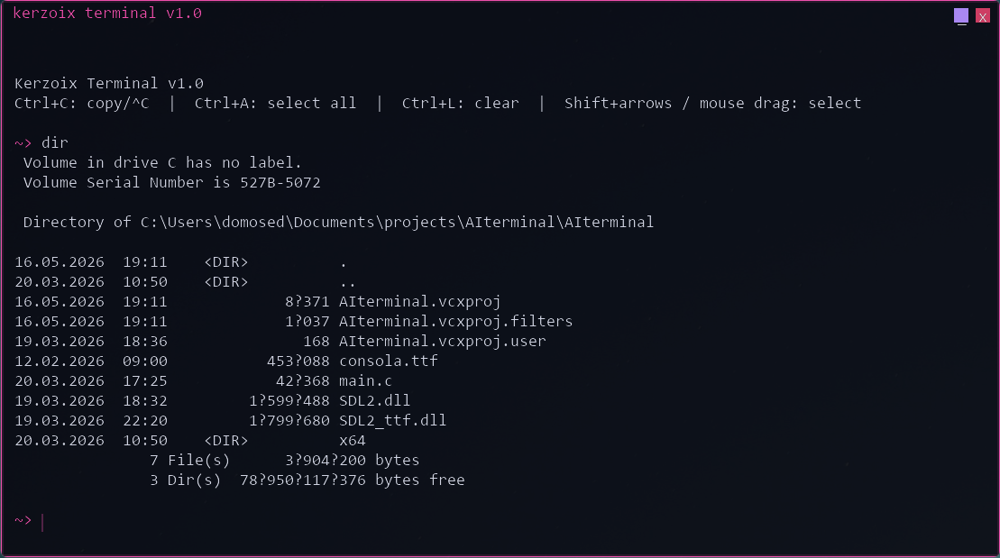

# Kerzoix Terminal

A lightweight, custom-styled terminal emulator for Windows, written in C. The application presents a borderless SDL2 window with a synthwave-inspired UI, renders text through a prebuilt glyph atlas, and runs shell commands asynchronously so the interface stays responsive while output streams in.

The project ships as a single source file (`AIterminal/main.c`) plus a Visual Studio solution. Despite the repository name **AIterminal**, the window title and branding use **Kerzoix Terminal v1.0**.

---

## Features

### Appearance

- **Borderless window** (1110×620) with a 2 px magenta border, inner glow, and rounded corners on Windows 11 via DWM
- **Custom title bar** with drag-to-move, minimize, and close controls
- **Dark theme**: near-black background (`#0A0A12`), pink accent (`#FF50B4`), light gray body text
- **Monospace rendering** via Consolas (`consola.ttf` next to the executable, or `C:\Windows\Fonts\consola.ttf`)
- **Fade-in** for new output lines (200 ms)
- **Letter pop-in** animation when typing in the input line
- **Smooth blinking cursor** on the active prompt

### Terminal behavior

- **Prompt** `~> ` for both the live input line and echoed command lines in the scrollback
- **Command execution** through `cmd.exe /C <command>` on Windows (hidden console window)
- **Non-blocking execution**: each command runs on an `SDL_Thread`; stdout/stderr are read line-by-line and appended to the scrollback while the UI keeps rendering
- **Spinner** (`| / - \`) shown on the input row while a command is running; keyboard input is blocked until completion
- **Command history** (up to 64 entries): **Up** / **Down** to recall previous commands
- **Automatic line wrapping** based on content width and glyph metrics
- **Scrollback** up to 512 lines (ring buffer); mouse wheel and Page Up/Down to scroll; scrollbar thumb when content overflows

### Selection and clipboard

- **Mouse drag** in the output buffer to select text across lines
- **Shift + arrow keys** in the input line to select characters
- **Ctrl+C**:
  - Copies buffer or input selection to the Windows clipboard (UTF-16), when a selection exists
  - Otherwise clears the input and prints `^C` (bash-style interrupt hint; does not kill the running subprocess)
- **Ctrl+A** selects all text in the input line
- **Ctrl+L** clears the scrollback and resets scroll position
- **Escape** clears all selections

### Window management

- Drag the **title bar** to move the window
- **Minimize** and **close** buttons in the top-right corner
- Layered window alpha (~235/255) on Windows for a slightly translucent frame

---

## Keyboard shortcuts

| Shortcut | Action |
|----------|--------|
| **Enter** | Run the current input line |
| **Up / Down** | Previous / next command in history |
| **Left / Right** | Move cursor in the input line |
| **Shift + Left / Right** | Extend input selection |
| **Home / End** | Jump to start / end of input |
| **Shift + Home / End** | Select to start / end of input |
| **Backspace / Delete** | Edit input; deletes selection if active |
| **Ctrl+C** | Copy selection, or clear input and show `^C` |
| **Ctrl+A** | Select all in input |
| **Ctrl+L** | Clear scrollback |
| **Page Up / Page Down** | Scroll output by one screen |
| **Mouse wheel** | Scroll output (3 lines per notch) |
| **Escape** | Clear selections |

---

## Requirements

### Build

- **Windows 10/11** (primary target; Win32 APIs used for process I/O, clipboard, and window chrome)
- **Visual Studio 2022** (or compatible) with the **v145** platform toolset and **Windows 10 SDK**
- **SDL2** development libraries (headers + `SDL2.lib`, `SDL2main.lib`)
- **SDL2_ttf** development libraries (headers + `SDL2_ttf.lib`)

The `.vcxproj` currently points include/lib paths at a local `deps` layout (see [Building](#building)). Adjust paths in `AIterminal/AIterminal.vcxproj` to match your machine.

### Runtime

Place these next to `AIterminal.exe` (typical Debug output: `AIterminal/x64/Debug/`):

| File | Purpose |
|------|---------|
| `SDL2.dll` | SDL video, events, rendering |
| `SDL2_ttf.dll` | Font loading and glyph rasterization |
| `consola.ttf` | Optional; falls back to Windows Consolas |

---

## Building

1. Install **SDL2** and **SDL2_ttf** for Visual C++ (x64). A common layout:

   ```
   deps/
     include/          SDL.h, SDL_ttf.h, ...
     lib/x64/          SDL2.lib, SDL2main.lib
   ttf-deps/
     include/
     lib/x64/          SDL2_ttf.lib
   ```

2. Open `AIterminal.slnx` in Visual Studio (or open `AIterminal/AIterminal.vcxproj`).

3. Update **Additional Include Directories** and **Additional Library Directories** in the project properties if your SDL paths differ from those in the `.vcxproj`.

4. Select configuration **Debug** or **Release**, platform **x64** (recommended; x64 has full SDL link settings in the project).

5. Build (**Ctrl+Shift+B**). The executable is produced under `AIterminal/x64/<Configuration>/`.

6. Copy `SDL2.dll`, `SDL2_ttf.dll`, and optionally `consola.ttf` into the output folder.

> **Note:** Win32 configurations in the project do not list SDL libraries in the checked-in `.vcxproj`; use **x64** unless you add the same linker settings for Win32.

---

## Usage

1. Run `AIterminal.exe` from a directory where the DLLs and font are available.

2. Type a shell command after the `~>` prompt and press **Enter**. Examples:

   ```
   dir
   echo Hello
   git status
   ```

3. Output appears in the scrollback above the input line. Long output can be scrolled with the mouse wheel or Page Up/Down.

4. To copy output, drag with the mouse to select, then press **Ctrl+C**.

While a command runs, the input area shows `running` with an animated spinner; wait for completion before entering another command (a new command waits for the previous thread to finish if you submit one immediately after).

---

## Architecture

All logic lives in `AIterminal/main.c` (~1130 lines). The central `Terminal` struct holds SDL objects, the line ring buffer, input state, selection, history, scroll position, and command-thread handles.

### Rendering pipeline

1. **Font atlas** (`build_atlas`): At startup, printable ASCII (32–126) is rasterized with SDL_ttf into a 512×512 RGBA texture. Each glyph stores a source rectangle and horizontal advance.

2. **Drawing** (`draw_char` / `draw_string`): Characters are blitted from the atlas with per-draw color and alpha modulators—no per-frame TTF rendering during normal use.

3. **Frame loop**: Clear background → border → title bar → scrollback → input line → scrollbar → `SDL_RenderPresent`, driven by `SDL_PollEvent`.

### Output buffer

- `TermLine` entries hold text, type (`LINE_OUTPUT` or `LINE_PROMPT`), and `birth_tick` for fade-in.
- `line_count` grows monotonically; storage uses `lines[line_count % MAX_LINES]` (512 slots).
- Long lines are split into multiple visual rows according to `content_w / glyph_w`.

### Command execution

```
Main thread                          Background SDL thread
───────────                          ─────────────────────
handle_return()                      cmd_thread_func()
  → term_add_line (prompt echo)        → CreateProcess("cmd.exe /C …")
  → SDL_CreateThread                     → ReadFile on pipe, push_line per line
  → cmd_running = true                   → push_line (mutex-protected)
                                       → EV_CMD_DONE event
EV_CMD_LINE / EV_CMD_DONE              Main: cmd_running = false, join thread
  → redraw / scroll reset
```

- `lines_mutex` protects scrollback writes from the worker thread.
- Custom SDL events `EV_CMD_LINE` and `EV_CMD_DONE` wake the main loop for redraw and completion handling.

On non-Windows builds, the `#else` branch uses `popen` instead of `CreateProcess`; the rest of the UI is still oriented toward Windows (clipboard, minimize, DWM).

### Windows integration

- **Process I/O**: Anonymous pipe, `CREATE_NO_WINDOW`, merged stdout/stderr.
- **Clipboard**: `OpenClipboard` / `CF_UNICODETEXT` with UTF-8 → wide conversion.
- **Window**: `SDL_WINDOW_BORDERLESS`, `WS_EX_LAYERED`, `DwmSetWindowAttribute` for rounded corners.

---

## Configuration constants

Defined at the top of `main.c` and easy to tweak:

| Constant | Default | Description |
|----------|---------|-------------|
| `SCREEN_WIDTH` / `SCREEN_HEIGHT` | 1110 / 620 | Window size in pixels |
| `FONT_SIZE` | 18 | TTF point size |
| `MAX_INPUT` | 512 | Input buffer length |
| `MAX_LINES` | 512 | Scrollback ring capacity |
| `MAX_LINE_LEN` | 1024 | Maximum characters per stored line |
| `MAX_HISTORY` | 64 | Command history depth |
| `TITLEBAR_H` | 32 | Custom title bar height |
| `BORDER_W` | 2 | Border thickness |
| `SCROLL_SPEED` | 3 | Lines per mouse wheel step |

Color macros (`COL_*`, `TCOL_*`) control UI and text colors (RGB).

---

## Project structure

```
AIterminal/
├── AIterminal.slnx          Visual Studio solution
├── README.md                This file
├── docs/
│   └── screen.png           Application screenshot
└── AIterminal/
    ├── main.c               Full application source
    ├── AIterminal.vcxproj   MSVC project (SDL paths, x64 link libs)
    ├── consola.ttf          Bundled font (optional at runtime)
    ├── SDL2.dll             Runtime dependency (not in repo if gitignored)
    ├── SDL2_ttf.dll
    └── x64/Debug/           Build output (exe, logs, tlogs)
```

---

## Limitations and notes

- **Windows-first**: Shell integration and clipboard require Win32; Linux/macOS would need additional porting beyond the `popen` fallback.
- **Ctrl+C** does not terminate a running subprocess; it only affects local input/selection behavior unless you extend the code.
- **Concurrent commands**: Submitting a new command waits for the previous thread to exit; there is no job control or tabbing.
- **Character set**: Rendering supports printable ASCII (32–126); other Unicode input depends on SDL text events but non-ASCII glyphs are not in the atlas.
- **Repository vs. branding**: Git/project name is `AIterminal`; UI strings say **Kerzoix Terminal v1.0**.

---

## Dependencies

- [SDL2](https://www.libsdl.org/) — window, renderer, events, threading
- [SDL2_ttf](https://github.com/libsdl-org/SDL_ttf) — TrueType font rendering for the glyph atlas
- **Consolas** — terminal face (bundled `consola.ttf` or system font)

---

## License

No license file is included in the repository. Add one if you plan to distribute the project.
